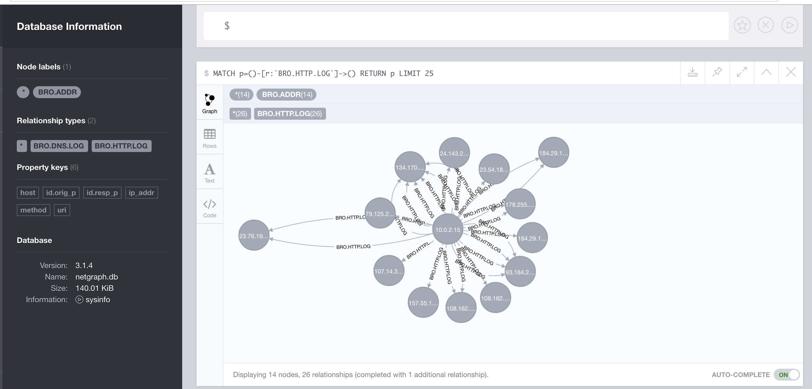

# Bro Log importer for Neo4J

## Summary

Import bro logs into neo4j. The intention is to import more log types, but this is just the start. Additional logs may include Snort etc.

## Usage

```
$ ls path/to/bro/logs
files.log http.log conn.log .... 
$ make graph BRO_LOG_DIR=path/to/bro/logs
cat brologs/conn.log |  docker run -i hempnall/bro /usr/local/bro/bin/bro-cut id.orig_h id.resp_h > conn.log.selected_fields
awk -F '\t' '{ print $1 }' < conn.log.selected_fields | grep -v '^$'  >> conn.log.ip_addresses.used_fields	 
awk -F '\t' '{ print $2 }' < conn.log.selected_fields | grep -v '^$'  >> conn.log.ip_addresses.used_fields	 
cat conn.log.ip_addresses.used_fields | sort | uniq > conn.log.ip_addresses.unique_and_sorted
mv conn.log.ip_addresses.unique_and_sorted conn.log.ip_
..... yada yada yada ....
[>:??--------------------|*COUNT:76.29 MB-----------------------------------------------------]10.0K
Done in 54ms
Relationship counts
[>:??---------------------------|*COUNT-------------------------------------------------------]10.0K
Done in 10ms

IMPORT DONE in 2s 937ms. 
Imported:
  24 nodes
  79 relationships
  260 properties
Peak memory usage: 43.87 MB
rm http.log.selected_fields http.log.ip_addresses.used_fields dns.log.selected_fields dns.log.ip_addresses.used_fields ssl.log.ip_addresses.used_fields dhcp.log.ip_addresses.used_fields conn.log.selected_fields conn.log.ip_addresses.used_fields ssl.log.selected_fields
$ make start
docker run \
    	--publish=7474:7474 --publish=7687:7687 \
    	--volume=/Users/me/dev/playpen/nemesis/data:/data \
    	--volume=/Users/me/dev/playpen/nemesis/logs:/logs \
   	--env=NEO4J_dbms_active__database=netgraph.db \
   	--env=NEO4J_dbms_directories_data=/data \
	--env=NEO4J_dbms_security_auth__enabled=false \
    	neo4j:3.1
Starting Neo4j.
2017-05-18 20:15:40.221+0000 INFO  ======== Neo4j 3.1.4 ========
2017-05-18 20:15:40.265+0000 INFO  No SSL certificate found, generating a self-signed certificate..
2017-05-18 20:15:41.109+0000 INFO  Starting...
2017-05-18 20:15:41.991+0000 INFO  Bolt enabled on 0.0.0.0:7687.
2017-05-18 20:15:46.909+0000 INFO  Started.
2017-05-18 20:15:48.490+0000 INFO  Remote interface available at http://localhost:7474/
```
## Then..

Connect your browser to ```http://localhost:7474```




